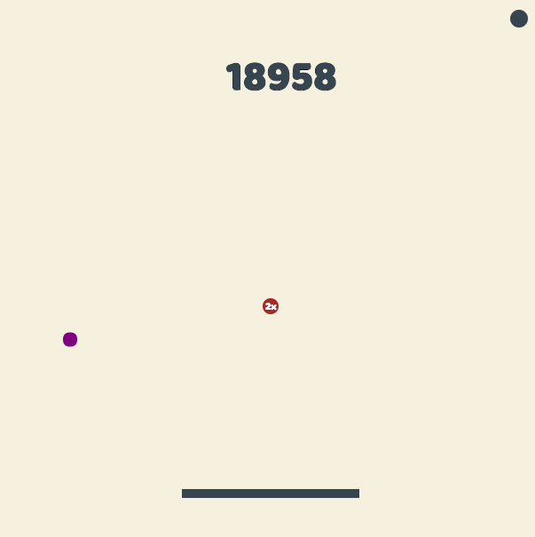

# Plips

[Live][plips]
[plips]: http://dansuh.me/Plips/

Plips is a single-player, Pong-like game in which the player juggles balls as they bounce by and increase in number.

It is built on HTML5, JavaScript, and jQuery and uses the HTML5 Canvas API/Audio Tag for visual/audio rendering.

## Future Directions

#### Powerups

On "paddling", or collision of the paddle with occasionally falling powerups, the type of powerup will enhance the player's ability to score higher. Potential powerups include: a temporarily enlargened paddle, score multipliers, slower balls, etc.
