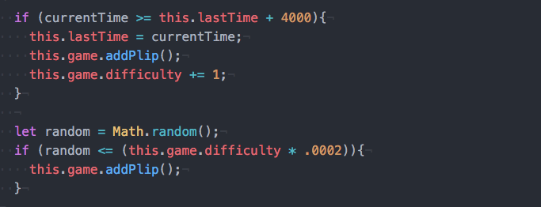

# Plips

Plips is a single-player, Pong-like game in which the player juggles balls as they bounce by and increase in number.

## Tech
Plips will implement HTML, CSS, JavaScript, and jQuery as well as the following tools:

  * the `keymaster` library to register key strokes
  * the `Canvas` API for visual rendering
  * the `Audio` HTML5 tag for audio rendering

## Features
- [X] game menu page
- [X] falling balls with random velocity, affected by a universal gravity constant
- [X] increasing amount of balls to juggle (difficulty)
- [X] random color generation for each ball
- [X] player is allowed 3 lives/chances per game
- [X] rising score for each ball bounce
- [X] sounds for ball bouncing, losing a life, game over
- [X] game over page
- [ ] player allowed to enter name in leaderboard (*bonus*)
- [X] power ups (*bonus*)

## Challenges/solutions

#### Simulating difficulty
More plips needed to appear as difficulty/time elapsed increased. However, this proved to be more complicated as the animation functions ran every 16.7 milliseconds due to `window.requestAnimationFrame`.

I simulated an "unfair coin toss" algorithm. With each iteration, a random float between 0 and 1 was chosen, and with the product of a constant with a `difficulty` variable that incremented every 4 seconds, the odds of a ball rendering rose.

#### Delegating renders
Rendering a paddle, a variable amount of plips, a score, remaining lives, powerups, and small effects is a lot for just one `Canvas`. Therefore, I created another `Canvas` on top of the main `Canvas` with a transparent background. This secondary `Canvas` was responsible for rendering the small effects that did not need any more incoming information once they were initialized.

## Timeline

### Phase 1 (Day 1):
- [X] Gravity and movement of a ball
- [X] Random color generation for ball
- [X] Player paddle (`keymaster`)

### Phase 2 (Day 2):
- [X] Increasing number of balls
- [X] score
- [X] audio for ball bounce, game over
- [X] powerups (*bonus*)

### Phase 3 (Day 3):
- [X] Create gamepage design/base canvas
- [X] Start/End menu
- [ ] Leaderboard (*bonus*)

<!-- -->
